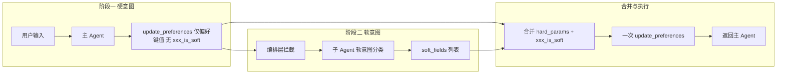

# 意图接口设计方案 v3

> 在 v2 基础上，将「软/硬意图一步识别」改为「先硬意图、后由子 Agent 单独做软意图识别」的两阶段流程，降低主 Agent 在软硬判断上的出错率。硬意图识别采用**方案 A**：主 Agent 仍调用 `update_preferences`，但 TOOLS schema 中不暴露 `xxx_is_soft` 参数，由编排层在收到调用后先调用子 Agent 再合并执行。

---

## 一、设计目标与问题分析

### 1.1 v2 现状与痛点

- **v2 流程**：主 Agent 在单次 `update_preferences` 调用中同时完成「偏好抽取」和「软/硬判断」（通过各字段的 `xxx_is_soft`）。
- **问题**：一步完成两件事导致软硬意图识别易错。LLM 容易混淆「最好/希望/尽量」与「要/必须/需要」，进而错误设置或漏设 `xxx_is_soft`，影响过滤与排序效果。

### 1.2 v3 目标

1. **硬意图优先**：主 Agent 只负责从用户输入中抽取「本轮提到的偏好」键值对，不再承担软硬分类。
2. **软意图由子 Agent 单独识别**：在硬意图（偏好键值）确定之后，由专用子 Agent 根据用户原文对「已抽取字段」做软/硬分类，输出应视为软约束的字段名列表。
3. **编排层合并后一次执行**：编排层将主 Agent 的调用参数与子 Agent 的 `soft_fields` 合并为带 `xxx_is_soft` 的完整参数，再调用一次 `update_preferences`，对 [tools.py](tools.py) 的接口与实现保持兼容。

---

## 二、新流程总览



- **阶段一**：主 Agent 仍调用 `update_preferences`，但仅传偏好键值（location、max_price、decoration、elevator 等），**不传任何 `xxx_is_soft`**（主 Agent 使用的 TOOLS schema 中不包含 `xxx_is_soft` 参数）。
- **阶段二**：编排层拦截到主 Agent 的 `update_preferences` 调用后，先调用子 Agent；输入为「用户本轮原文 + 本轮回传的偏好键值」，输出为「应视为软约束的字段名列表」`soft_fields`。
- **合并与执行**：编排层构造 `final_args = 主 Agent 参数 + { f + "_is_soft": True for f in soft_fields }`，再调用真正的 `update_preferences(client, session_prefs, **final_args)`，将结果返回给主 Agent 流程。

---

## 三、阶段一：硬意图识别（方案 A）

### 3.1 执行方与接口

- **执行方**：主 Agent（即当前 [agent.py](agent.py) 中的 `run_agent` 所使用的模型）。
- **接口形态**：主 Agent 仍然调用工具 `update_preferences`，但**主 Agent 可见的 TOOLS schema 中移除所有 `xxx_is_soft` 参数**，仅保留偏好相关字段（location、clear_location、min_price、max_price、bedrooms、decoration、elevator、orientation、floor_pref、pet_policy、required_nearby 等），以及语义快捷字段（如 price_around、area_around、near_subway）。
- **输出**：主 Agent 产出一组「本轮新增/变更」的 `(field, value)`，且不包含任何 `xxx_is_soft`。编排层默认将这些字段均视为硬约束，除非子 Agent 在阶段二将其标记为软约束。

### 3.2 主 Agent 的 update_preferences schema 变更（v3）

- 在提供给主 Agent 的 TOOLS 列表中，`update_preferences` 的 `parameters.properties` **不再包含**以下参数：  
  `decoration_is_soft`、`elevator_is_soft`、`near_subway_is_soft`、`orientation_is_soft`、`floor_pref_is_soft`、`rental_type_is_soft`、`pet_policy_is_soft`、`viewing_method_is_soft`、`viewing_time_is_soft`、`lease_flexibility_is_soft`、`termination_sublet_is_soft`、`parking_type_is_soft`、`security_requirement_is_soft`、`property_management_is_soft`、`environment_preference_is_soft`、`house_feature_is_soft`、`landlord_contract_is_soft`、`required_utilities_is_soft`、`required_nearby_is_soft`、`payment_method_is_soft`、`deposit_type_is_soft`、`no_agent_fee_is_soft`。
- 其余参数与 v2 的 [tools.py](tools.py) 中 `update_preferences` 定义保持一致（含 location、价格、户型、标签类等），以便主 Agent 只做「偏好抽取」而不做软硬判断。

### 3.3 主 Agent 的 system prompt 调整建议

- 删除或弱化「软约束：用户语气为最好/如果能…时设 xxx_is_soft: true」等描述，改为仅强调：根据用户输入提取本轮提到的偏好字段与取值，未提及的字段不传。
- 可保留「用户说 N 左右 → price_around / area_around」「近地铁 → near_subway」等语义到参数的映射说明。

---

## 四、阶段二：软意图识别（子 Agent）

### 4.1 职责

- **仅做软/硬分类**：在已有关键词与取值的基础上，根据用户原文判断哪些字段是「软偏好」（匹配则加分、不匹配不排除），哪些是「硬约束」（不满足则排除）。
- **不抽取新字段**：子 Agent 不负责从原文中抽取新的偏好键值，只针对阶段一已给出的字段做分类。

### 4.2 输入（建议 JSON）

| 字段 | 类型 | 说明 |
|------|------|------|
| `user_message` | string | 用户本轮原文（或最近一轮与找房相关的用户消息） |
| `extracted_preferences` | object | 阶段一产出的键值对，即主 Agent 本轮回传的 `update_preferences` 参数（不含 `xxx_is_soft`） |

示例：

```json
{
  "user_message": "西城中铝两居，希望空房、最好是朝南，必须有电梯尽量低楼层，预算5000左右近地铁",
  "extracted_preferences": {
    "location": ["西城", "中铝"],
    "bedrooms": "2",
    "decoration": "空房",
    "orientation": "朝南",
    "elevator": true,
    "floor_pref": "低层",
    "max_price": 5000,
    "near_subway": true
  }
}
```

### 4.3 输出（建议 JSON）

| 字段 | 类型 | 说明 |
|------|------|------|
| `soft_fields` | array of string | 应设为软约束的字段名列表，对应 `xxx_is_soft: true`；未出现在此列表中的已抽取字段视为硬约束 |

示例：

```json
{
  "soft_fields": ["decoration", "orientation", "floor_pref"]
}
```

即：用户说「希望空房、最好是朝南」「尽量低楼层」，则 decoration、orientation、floor_pref 为软约束；「必须有电梯」对应的 elevator 不入 soft_fields，按硬约束处理。

### 4.4 子 Agent 判断规则（写入其 system prompt）

- **软约束（加入 soft_fields）**：用户对某维度使用「最好/希望/尽量/如果能/优先/有…更好/…就更好了/可以的话/理想情况/倾向于」等表达时，该维度对应的字段名加入 `soft_fields`。
- **硬约束（不加入 soft_fields）**：用户使用「要/必须/需要/一定/只能/不能/得」等明确要求时，该字段不入 `soft_fields`。
- **仅对已抽取字段分类**：若 `extracted_preferences` 中未包含某字段，子 Agent 不输出该字段；仅对 `extracted_preferences` 中出现的、且支持软约束的字段做判断。

### 4.5 支持软约束的字段列表

与 v2 及 [tools.py](tools.py) 一致，以下字段可设为软约束（即存在对应的 `xxx_is_soft`）：

- `decoration`、`elevator`、`orientation`、`floor_pref`、`rental_type`、`max_subway_dist`（以及语义等价 `near_subway` 映射到 max_subway_dist 时的软约束）
- `pet_policy`、`viewing_method`、`viewing_time`、`lease_flexibility`、`termination_sublet`、`parking_type`、`security_requirement`、`property_management`、`environment_preference`、`house_feature`、`landlord_contract`
- `required_utilities`、`required_nearby`
- `payment_method`、`deposit_type`、`no_agent_fee`

子 Agent 输出的 `soft_fields` 中的名称必须属于上述集合，且仅当该字段出现在 `extracted_preferences` 中时才可被加入。

### 4.6 子 Agent 调用方式

- **实现形态**：独立的一次 LLM 调用（无 ReAct/多轮），输入为上述 JSON，输出解析为 `soft_fields`；可由编排层在拦截到主 Agent 的 `update_preferences` 后同步调用。
- **与主 Agent 的关系**：可由编排层在 [agent.py](agent.py)（或 main 入口）中实现：检测到主 Agent 请求调用 `update_preferences` 时，先调用子 Agent 获取 `soft_fields`，再合并参数并执行 `update_preferences`，最后将执行结果作为工具结果返回给主 Agent。

---

## 五、合并与执行

### 5.1 编排层逻辑

1. 主 Agent 发出 `update_preferences(args)`，其中 `args` 不含任何 `xxx_is_soft`。
2. 编排层调用子 Agent，输入 `user_message`（可从当前对话历史取最后一条 user 消息）与 `extracted_preferences = args`，得到 `soft_fields`。
3. 构造最终参数：
   - `final_args = dict(args)`
   - 对 `soft_fields` 中且属于「支持软约束的字段列表」的每一项 `f`，若 `extracted_preferences` 中存在键 `f`，则设置 `final_args[f + "_is_soft"] = True`。  
   - 特殊：若 `extracted_preferences` 中有 `near_subway` 且 `"near_subway" in soft_fields`，则设置 `final_args["near_subway_is_soft"] = True`（与 [tools.py](tools.py) 中 `near_subway_is_soft` 对应 `max_subway_dist` 的软约束一致）。
4. 调用 `update_preferences(client, session_prefs, **final_args)`，将返回值作为本次工具调用的结果返回给主 Agent。

### 5.2 与 tools.py 的兼容性

- `update_preferences` 的函数签名与内部实现（含 `xxx_is_soft` → `soft_constraint_keys`、合并与搜索逻辑）无需修改。
- 仅调用方（编排层）在传入前合并 `_is_soft`；主 Agent 侧 TOOLS schema 为 v3 裁剪版（无 `xxx_is_soft`）。

---

## 六、与 v2 的差异总结

| 维度 | v2 | v3（方案 A） |
|------|-----|----------------|
| 软/硬判断 | 主 Agent 一步完成，在调用 update_preferences 时同时传 xxx_is_soft | 主 Agent 只传偏好键值；软硬判断由子 Agent 在编排层单独完成 |
| 主 Agent 的 update_preferences schema | 包含全部 xxx_is_soft 参数 | 不包含任何 xxx_is_soft 参数 |
| 子 Agent | 无 | 有；输入为 user_message + extracted_preferences，输出为 soft_fields |
| 执行次数 | 主 Agent 直接调用 update_preferences 一次 | 编排层合并后仍调用 update_preferences 一次，对 tools.py 行为一致 |
| UserPreferences / post_filter_and_rank | 不变 | 不变 |

---

## 七、实现优先级与影响范围

| 优先级 | 变更项 | 影响范围 |
|--------|--------|----------|
| P0 | 编排层：拦截主 Agent 的 update_preferences 请求 → 调子 Agent 得 soft_fields → 合并 → 再调 update_preferences；子 Agent 的 prompt 与输入输出解析 | [agent.py](agent.py) 或 main 入口 |
| P0 | 主 Agent 使用的 TOOLS：从 update_preferences 的 schema 中移除所有 xxx_is_soft 参数 | [agent.py](agent.py) 或 [tools.py](tools.py)（可为「主 Agent 用」单独导出一份 TOOLS_MAIN 或编排层过滤并注入 _is_soft） |
| P1 | 主 Agent 的 system prompt：去掉软硬判断相关描述，仅保留偏好抽取与语义映射 | [agent.py](agent.py) |
| P2 | 测试与评测：若有针对软硬判定的用例，验证两阶段结果与 v2 预期一致或更优 | 测试用例 / 评测脚本 |

---

## 八、参考

- 意图与工具体系、偏好字段与标签映射详见 [docs/intent_interface_design_v2.md](intent_interface_design_v2.md)。
- `update_preferences` 与搜索流水线实现见 [tools.py](tools.py)；主 Agent 循环与工具分发表见 [agent.py](agent.py)。
