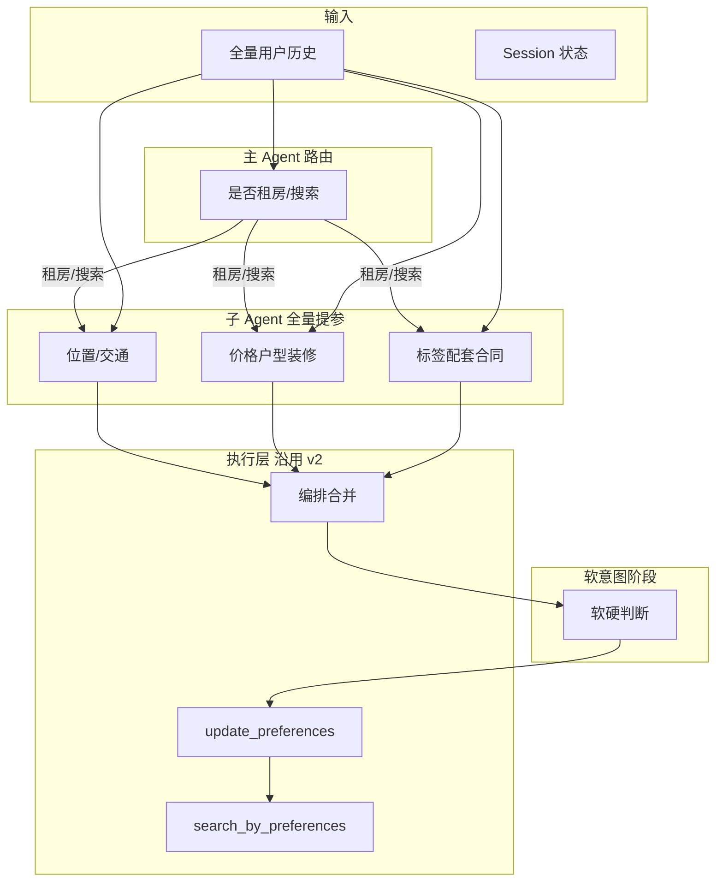

# 意图接口设计方案 v3

> 基于 v2 与测试报告问题，采用「分而治之 + 全量提参」：主 Agent 仅做租房意图路由，多子 Agent 分领域全量提参（每轮输入全历史、输出全量偏好），软意图两阶段判断；测试用例按全量意图同步整改。

---

## 一、设计目标与原则

1. **提升提参成功率**：通过缩小单模型决策空间（路由 + 分领域子 Agent + 软硬分离），降低意图空间过大、硬软同提、多轮错漏等问题。
2. **全量提参**：每轮子 Agent 接收**全部用户历史**，输出**到当前轮为止的该领域全量偏好**；编排层合并后得到整轮全量，一次性传入 `update_preferences`。不做「仅本轮增量」的抽取与断言。
3. **测试与实现一致**：测试用例按**全量意图**书写——每轮 `tool_call_args.contains` 表示「该轮对话结束后应出现的全部参数集合」；实际 args 允许包含更多键（不判 WARN），仅校验 contains 中声明的键存在且值等价。

---

## 二、与 v2 的差异概览

| 维度          | v2                               | v3                                                       |
| ----------- | -------------------------------- | -------------------------------------------------------- |
| 提参方式        | 单一大模型一次 function call，39+ 参数     | 主 Agent 路由 + 多子 Agent 分领域，每领域小 schema                    |
| 每轮输入        | 当前轮消息 + 上下文                      | **全量历史**交给各子 Agent                                       |
| 每轮输出        | 期望「本轮增量」传工具                      | **全量偏好**合并后传工具（该轮应有状态）                                   |
| 软/硬         | 同一步骤同时输出取值 + xxx_is_soft         | **两阶段**：先提取值，再单独判断软硬                                     |
| 测试 contains | 实际 args 键与 contains 完全一致，多键 WARN | **全量意图**：contains = 该轮应有全量键值；实际 args 包含 contains 即可，允许多键 |

---

## 三、整体架构

- **主 Agent（Router）**：仅判断本轮意图是否为「租房/搜房」相关（含多轮补充、换区、调预算等）。若是则进入子 Agent 流水线；否则走闲聊/详情/比价/执行等既有分支。
- **子 Agent**：每轮接收**全量用户历史**（或最近 N 轮 + 更早摘要），各自输出**该领域到当前轮为止的全量偏好**（未提及字段不填）。三领域划分见下节。
- **软意图阶段**：对合并结果中支持软约束的字段，单独做「硬/软」判断并写入 `xxx_is_soft`。
- **编排层**：合并三路全量输出 + 软判断结果 → 得到**本轮回完整 kwargs**，调用 `update_preferences(session_prefs, **kwargs)`。工具层不变，仍按 v2 做字段合并与覆盖。

---

## 四、子 Agent 领域划分与参数归属

与 v2 参数空间一致，仅按职责拆成三块，便于小 schema 与小 prompt。

### 4.1 位置 / 交通子 Agent

| 参数                    | 说明                                      |
| --------------------- | --------------------------------------- |
| `location`            | 行政区/商圈/地标/地铁站/小区名                       |
| `clear_location`      | 是否清除之前位置（换区场景）                          |
| `max_subway_dist`     | 到地铁最大距离（米）                              |
| `near_subway`         | 近地铁（true 时排序按地铁距离，并可能设 max_subway_dist） |
| `subway_line`         | 地铁线路                                    |
| `max_commute_minutes` | 到西二旗通勤上限（分钟）                            |

### 4.2 价格 / 户型 / 房屋属性子 Agent

| 参数                       | 说明                                |
| ------------------------ | --------------------------------- |
| `min_price`, `max_price` | 月租金范围                             |
| `price_around`           | 「XX左右」时传中心值（编排或 tools 侧转 min/max） |
| `bedrooms`               | 卧室数，字符串如 "2", "2,3"               |
| `rental_type`            | 整租/合租                             |
| `decoration`             | 精装/简装/豪华/毛坯/空房                    |
| `elevator`               | 是否要电梯                             |
| `orientation`            | 朝向                                |
| `floor_pref`             | 低层/中层/高层                          |
| `min_area`, `max_area`   | 面积范围                              |
| `property_type`          | 住宅/公寓                             |
| `noise_preference`       | 安静等                               |
| `sort_by`, `sort_order`  | 排序                                |
| `available_before`       | 可入住日期上限 YYYY-MM-DD                |

### 4.3 标签 / 配套 / 合同子 Agent

| 参数                       | 说明                  |
| ------------------------ | ------------------- |
| `pet_policy`             | 宠物政策                |
| `viewing_method`         | 看房方式                |
| `viewing_time`           | 看房时间                |
| `lease_flexibility`      | 租期灵活性               |
| `required_utilities`     | 须含费用项（包水电/包宽带等）     |
| `utilities_type`         | 水电类型（民水民电/商水商电）     |
| `required_nearby`        | 周边配套（近公园/近医院/近健身房等） |
| `termination_sublet`     | 退租/转租政策             |
| `parking_type`           | 车位类型                |
| `security_requirement`   | 安保/门禁               |
| `property_management`    | 物业管理                |
| `environment_preference` | 小区环境                |
| `house_feature`          | 房屋特点                |
| `landlord_contract`      | 合同/房东               |
| `no_agent_fee`           | 免中介/房东直租            |
| `payment_method`         | 月付/季付等              |
| `deposit_type`           | 押一/押二/押三            |
| `listing_platform`       | 链家/安居客/58同城         |

子 Agent 只输出**取值**，不输出 `xxx_is_soft`；软硬在后续阶段统一打标。

---

## 五、全量提参流程说明

1. **每轮触发**：用户发送一条新消息后，若主 Agent 判定为租房/搜房意图，则进入提参流水线。
2. **输入构造**：编排层将**当前会话全部用户历史**（或最近 K 轮原文 + 更早一句摘要）作为子 Agent 的输入。可选标注「当前轮」以便模型关注最新一句。
3. **并行调用**：三路子 Agent 并行调用，各自基于同一份全历史输出**本领域全量偏好**（仅包含有取值的键）。
4. **合并**：编排层按字段归属合并三路结果，得到一张「本轮回完整偏好」表（与 v2 的 update_preferences 参数空间一致）。
5. **软硬判断**：对 v2 中支持 `xxx_is_soft` 的字段，根据全历史中用户表述（如「最好/希望/尽量」→ 软），为相应字段设置 `xxx_is_soft: true`，其余不设或 false。
6. **调用工具**：`update_preferences(client, session_prefs, **full_kwargs)`。`full_kwargs` 即本轮回全量（仅含本次提取到的键）。tools.py 逻辑不变，按 v2 做合并与覆盖。

---

## 六、隐含意图映射（写入子 Agent prompt）

与 v2 文档 6.2 一致，在对应子 Agent 的 system prompt 中固化下表，用于「要健身、静养」等隐含表述。

| 用户表达                   | 提取参数                                                      |
| ---------------------- | --------------------------------------------------------- |
| 一个人住/自己住/不合租           | `rental_type: "整租"`                                       |
| 合租/找室友/单间              | `rental_type: "合租"`，单间时 `bedrooms: "1"`                   |
| 老人腿脚不便/不想爬楼            | `elevator: true`                                          |
| 近地铁/交通方便               | `max_subway_dist: 800` 或 `near_subway: true`              |
| 安静/不吵/隔音好/睡眠浅/**静养**   | `noise_preference: "安静"`                                  |
| 采光好/阳光/明亮              | `house_feature: "采光好"` 或 `orientation: "朝南"`              |
| 南北通透/通风好               | `house_feature: "南北通透"` 或 `orientation: "南北"`             |
| 空房/自己带家具               | `decoration: "空房"`                                        |
| **要健身/常健身/力量训练/附近能健身** | `required_nearby: ["近健身房"]`                               |
| 附近有公园/遛狗               | `required_nearby: ["近公园"]`                                |
| 附近有商场/超市               | `required_nearby: ["近商超"]`                                |
| 附近有医院/学校/餐饮            | `required_nearby: ["近医院"]` 等                              |
| 短租/住几个月                | `lease_flexibility: "可月租"` 等                              |
| 拎包入住                   | `decoration: "精装"` 或 `"豪华"`                               |
| 3000左右                 | `min_price: 2400, max_price: 3600` 或 `price_around: 3000` |

---

## 七、软意图两阶段规则

- **第一阶段（子 Agent）**：只填「有没有、取值是什么」，不填 `xxx_is_soft`。
- **第二阶段（软硬判断）**：对支持软约束的字段（与 v2 的 xxx_is_soft 列表一致），根据用户表述判断：
  - 「要/必须/得/需要」→ 硬约束，不设或设 `xxx_is_soft: false`
  - 「最好/希望/如果有/XX 更好/尽量」→ 软约束，设 `xxx_is_soft: true`

支持软约束的字段：decoration, elevator, orientation, floor_pref, max_subway_dist, rental_type, pet_policy, viewing_method, viewing_time, lease_flexibility, termination_sublet, parking_type, security_requirement, property_management, environment_preference, house_feature, landlord_contract, required_utilities, required_nearby, payment_method, deposit_type, no_agent_fee。

---

## 八、测试用例与 Runner 整改（全量意图）

### 8.1 约定

- **全量意图**：每轮 `tool_call_args.contains` 表示**该轮对话结束后应出现的全部参数**（键与期望值）。即「到本轮为止用户已表达的所有偏好的全量快照」。
- **校验方式**：实际 `update_preferences` 的 args 只需**包含** contains 中的每个键，且对应值等价；**允许实际 args 中出现 contains 未声明的额外键**，不再判 WARN。

### 8.2 Runner 变更要点

在 `test-simulator/runner.py` 的 `_tool_call_args` 中，为 v3 全量意图模式增加行为（可通过配置或环境变量切换）：

- **v3 模式**：`expected_keys = set(contains.keys())` 仍为「必须出现的键」；`allowed_keys` 改为「实际 args 的全部键」，即不再用 `allowed_keys = set(contains.keys())` 限制「仅允许 contains 的键」。
- 具体逻辑：
  - 缺少 contains 中声明的参数 → 仍为硬失败。
  - 实际多出的键 → **不**计入 extra，不报软失败（全量提参下实际 args 常为超集）。
  - 其余：location/decoration/required_nearby 等值等价规则与 v2 保持一致。

可选实现：在 `ToolCallArgsExpect` 或用例级增加 `full_intent: true`，当为 true 时采用上述 v3 校验；为 false 或未设时保持 v2 的「精确键一致」行为。

### 8.3 测试用例 YAML 整改要点

- 每轮 `round_expects[].expect.tool_call_args.contains` 写**该轮结束后的全量期望**。
- 例如：Round 1 用户说「朝阳两居 3000 以内近地铁最好精装」，则 contains 为该轮全量，如：`location: ["朝阳"], bedrooms: "2", max_price: 3000, max_subway_dist: 800, decoration: "精装", decoration_is_soft: true`（及可能出现的 sort_by/sort_order 等）。
- Round 2 用户说「要能养狗，希望附近有公园」，则 contains 为**到 Round 2 为止的全量**：在 Round 1 基础上增加/覆盖 `pet_policy: "可养狗", required_nearby: ["近公园"], required_nearby_is_soft: true` 等，而不是仅写本轮回新增的键。

这样用例表达的是「每轮结束后状态」，与全量提参的语义一致。

---

## 九、与现有资产的兼容

- **tools.py**：不修改。`update_preferences(client, session_prefs, **kwargs)` 仍为合并语义；v3 只是每轮传入的 `kwargs` 为「本轮回全量」而非「本轮增量」。
- **UserPreferences、post_filter_and_rank、search_by_preferences**：不变。意图空间与参数名与 v2 一致。
- **TOOLS 定义**：对外仍可只暴露一个 `update_preferences`；编排层在内部完成子 Agent 调用与合并后再调用该工具。

---

## 十、实现优先级建议

| **utilities_type**优先级 | 项                  | 说明                                                                    |
| --------------------- | ------------------ | --------------------------------------------------------------------- |
| P0                    | 主 Agent 路由         | 输入 (session, 当前消息)，输出 search_rent / chat / detail / listings / action |
| P0                    | 三领域子 Agent         | 独立 system prompt + 小 function schema，输入全历史，输出本领域全量                    |
| P0                    | 编排层合并 + 软判断        | 合并三路输出，执行软硬两阶段，调用 update_preferences                                  |
| P0                    | Runner 全量意图模式      | `full_intent` 或配置开关，允许实际 args 为 contains 的超集                          |
| P1                    | test_cases.yaml 整改 | 每轮 contains 改为该轮全量期望                                                  |
| P1                    | 隐含意图表              | 写入各子 Agent prompt（v2 6.2 迁移）                                          |
| P2                    | 历史截断/摘要            | 轮数过多时仅最近 N 轮 + 摘要，控制 token                                            |

---

## 十一、文档与版本

- 本文档为 **intent_interface_design_v3.md**，与 [intent_interface_design_v2.md](intent_interface_design_v2.md) 并列。
- v2 的工具体系、参数定义、场景映射、硬软规则仍为 v3 的执行层依据；v3 仅变更「提参来源」与「测试约定」。

