#  花￥1000用AI Coding搞竞赛，竟名落孙山

个人背景：核心网工程师，**10年+古法编程经验**，在产品线带团队孵化过XX，XX产品，对软件、系统、性能小有研究。

最近AI Coding很火，我也来蹭蹭热度，**本文摘要**：部门举办了个[AI Agent编程挑战赛](task.md)，时间很短（1周）。笔者自掏腰包，**花费￥1000**，使用**cursor + claude Opus 4.6**写了**1.3万行代码**（含测试+流程）。但结果却不尽如人意，我的代码在竞赛中排名后10%。文章记录了本次AI Coding的全过程，以及对AI Coding能力的看法与观点。

说明：本次赛题的资料均为外部公开，不涉及任何内部代码

## 1. 先说结论

这次失败主要是源于对竞赛需求的不理解，由于过分相信AI，导致我没有认真理解题目，我与AI均忽略了赛题关于“总token约束为300时间片”（截止前5小时才发现），我的算法在这个配额下只能完成15%的用例，这直接导致了本次失利。

我的一些总结与思考：

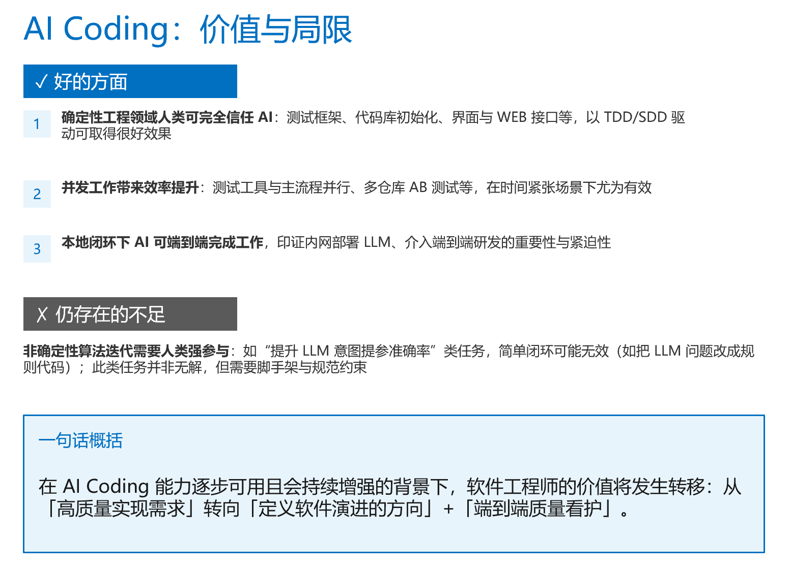

## 2. 为什么我要做这个事情

效仿OpenClaw作者Peter以及OpenAI团队的实践，两个案例均是在短短的几个月内，构筑了几十万行质量达到生产水平的代码，如果按华为产品开发端到端500人月的工作量来算，这已经将软件生产效率提升了100倍以上了。

因此，我希望通过实践，走他们走过的路，也期望能收获一些独特的感悟。

* [OpenAI harness-engineering](https://openai.com/zh-Hans-CN/index/harness-engineering/)：OpenAI 团队通过完全由 Codex 智能体编写代码、人类只做架构与规则设计的方式，仅用少量工程师、极短时间就完成百万行级别的可用软件项目，重新定义了 AI 时代工程师的角色与工程研发范式。
* [The creator of OpenClaw: "I ship code I don't read"](https://www.youtube.com/watch?v=8lF7HmQ_RgY&t=67s)：Peter 对 AI 编码的观点:价值在系统设计、验证和决策，不在手写实现；企业要改流程和角色才能用好 AI
  * **角色**：自己做架构师、定方向，不逐行看 AI 写的“管道代码”；多 AI 并行，用对话规划代替传统 PR。
  * **质量**：靠编译 → 测试 → 运行的闭环验证，少依赖人工逐行审；多用 CLI，少用 MCP。
  * **行业**：写代码成本下降，PR/Code Review/CI 会重构；企业可减约 30% 人力，但需要更多懂系统设计、能动性强的资深工程师。
  * **新人**：重点学系统设计（看开源、问 AI），不必纠结手写每一行；新人没包袱，更容易用 AI 玩出新用法。


## 3. 项目在做什么（不是关键，建议跳过）

### 3.1. 问题

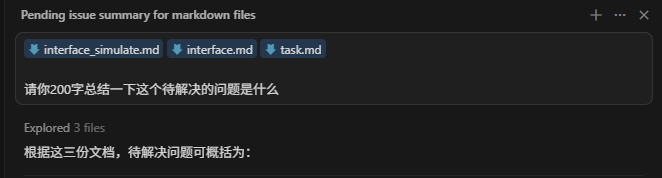

待解决问题总结（约 200 字）：
* 需要开发一个租房 AI Agent，在比赛环境中同时满足「判题接口」和「仿真数据源」的约定，并正确完成评测用例。
* 判题侧：Agent 需实现 POST /api/v1/chat，接收 session_id、message、model_ip，仅能通过判题器提供的模型接口（如 qwen3-32b）进行推理；完成房源查询时，response 必须是合法 JSON 字符串，包含 message 和 houses（房源 ID 列表），不能是纯自然语言。
* 仿真侧：调用房源相关接口必须带请求头 X-User-ID（平台注册工号）；新会话需调用房源重置接口以保证数据可复现；租房/退租/下架必须调用对应 API 才视为生效。
* 目标：在 300 时间片内按顺序跑完评测用例，在单用例 5 秒（不含模型调用时间）内返回结果，通过聊天、单轮、多轮等用例拿分，并在同分时尽量少耗 token 以提高排名。

### 3.2. 架构

一言以概之，写了个最简单的Agent，为了实现OpenClaw作者口中的**闭环**，特意搭建了一个本地的测试仿真器，通过严格的用例验证，确保本地测试仿真与内网API完全对齐

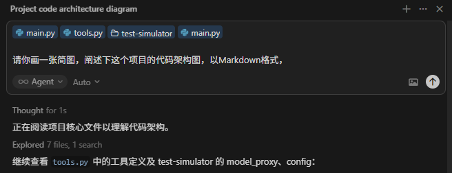

```
┌─────────────────────────────────────────────────────────────────────────────────┐
│                     Judge / Test Client (external)                              │
│                    POST /api/v1/chat (model_ip, session_id, message)            │
└───────────────────────────────────────────┬─────────────────────────────────────┘
                                            │
                                            ▼
┌─────────────────────────────────────────────────────────────────────────────────┐
│                         Main Service (project root)                             │
│  ┌─────────────┐                                                                │
│  │   main.py   │  FastAPI entry · Session management · Lifecycle                │
│  │             │  - lifespan: create httpx.AsyncClient (RENTAL_API_BASE)        │
│  │             │  - POST /api/v1/chat → session init / history → run_agent()    │
│  │             │  - Globals: sessions, session_stats, session_preferences       │
│  └──────┬──────┘                                                                │
│         │                                                                       │
│         │  history, model_ip, client, session_id, session_prefs                 │
│         ▼                                                                       │
│  ┌─────────────┐     ┌─────────────────────────────────────────────────────────┐│
│  │  agent.py   │────▶│ tools.py                                                ││
│  │             │     │ - UserPreferences, AREA_TO_DISTRICT, LANDMARK_NAMES     ││
│  │ LLM loop    │     │ - init_houses, get_all_houses_for_debug,                ││
│  │ - OpenAI    │     │   get_all_landmarks_for_debug                           ││
│  │   (model_ip │     │ - update_preferences, get_house_detail,                 ││
│  │   :8888)    │     │   execute_action, get_house_listings                    ││
│  │ - TOOLS     │     │ - All requests go through client to rental API          ││
│  │ - dispatch  │     └───────────────────────┬─────────────────────────────────┘│
│  └──────┬──────┘                             │                                  │
│         │                                    │ httpx.AsyncClient                │
│         │  log_event                         │ (RENTAL_API_BASE / Mock)         │
│         ▼                                    ▼                                  │
│  ┌─────────────┐     ┌─────────────────────────────────────────────────────────┐│
│  │  logger.py  │     │ Rental API (real or Mock)                               ││
│  │ jsonl per   │     │ - Real: RENTAL_API_BASE (e.g. http://7.225.29.223:8080) ││
│  │ session     │     │ - Test: test-simulator Mock Rental (:8080)              ││
│  └─────────────┘     └─────────────────────────────────────────────────────────┘│
└─────────────────────────────────────────────────────────────────────────────────┘

         │ LLM requests (model_ip:8888)
         ▼
┌─────────────────────────────────────────────────────────────────────────────────┐
│                     test-simulator (evaluation / local integration)             │
│  ┌─────────────────┐   ┌─────────────────┐  ┌─────────────────┐                 │
│  │ model_proxy.py  │   │ mock_rental.py  │  │  dashboard.py   │                 │
│  │ :8888           │   │ :8080           │  │  :8877          │                 │
│  │ Proxy /v1/chat/ │   │ 15 rental API   │  │  Interaction    │                 │
│  │ completions →   │   │ endpoints +     │  │  visualization  │                 │
│  │ real LLM        │   │ fixture data    │  │                 │                 │
│  └─────────────────┘   │ _reload_fixture │  └─────────────────┘                 │
│         ▲              └─────────────────┘                                      │
│         │                       ▲                                               │
│  ┌──────┴───────────────────────┴──────┐                                        │
│  │ main.py (simulator)                 │ config.yaml,test_cases.yaml,fixtures   │
│  │ - Start three services (proxy / mock / dashboard)                            │
│  │ - Optional: run_cases_parallel() → runner                                    │
│  └──────┬──────────────────────────────┘                                        │
│         │                                                                       │
│         ▼                                                                       │
│  ┌─────────────────┐  ┌─────────────────┐                                       │
│  │   runner.py     │  │   config.py     │                                       │
│  │ - send_message  │  │ - SimulatorConfig, TestCase, ExpectRules                │ 
│  │   → Agent       │  │ - TokenCounter, CaseResult, RoundDetail                 │ 
│  │   /api/v1/chat  │  │ - load_config, load_fixtures, load_test_cases           │
│  │ - Assertion     │  └─────────────────┘                                       │
│  │   engine        │                                                            │
│  │   (ASSERTION_   │                                                            │
│  │    RULES)       │                                                            │
│  │ - Report gen    │                                                            │
│  └─────────────────┘                                                            │
└─────────────────────────────────────────────────────────────────────────────────┘
```

### 3.3. 成果

128个测试用例，qwen-32b实现正确提参72个，正确率56.25%

### 3.4. 账单

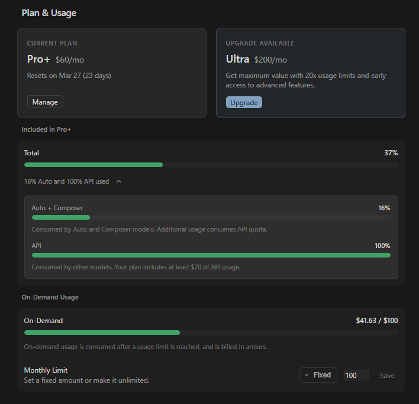
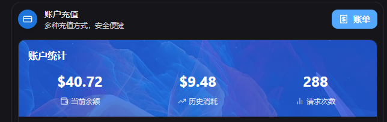
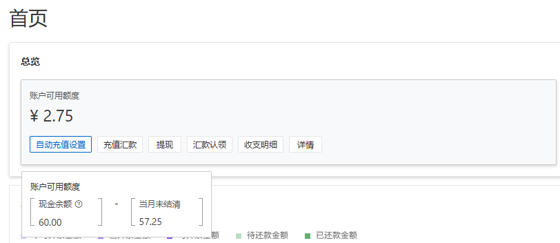

依次为：
* Cursor Pro, Pro+订阅：$80
* Claude Opus/Sonnet $41.63
* PoloAPI 模型聚合平台：$10
* 阿里云 Qwen3-32B API：￥60

## 4. 我的构思

下面详细展示一下我的整个AI Coding的全过程

### 4.1. 工具选型

* Claude 订阅：很容易被封号，需要有美国的家庭VPS做流量转发才可以使用，太麻烦了，后续配通再考虑
* Claude + PoloAPI（模型聚合平台）：通过配置Claude运行在API模式，对接三方API平台的Claude Opus/ Sonnet大模型，全程很丝滑，但问题就是有点贵，我还没开始干活，光分析代码库，闲聊了一下，就花掉了$10. 备注：这其实也是内网的一个好选择，只要内网有稳定可用的模型API（比如GLM-5，比如期待一下后续会发布的DS-V4），就可以做到稳定高效的编码
* 【最终选择】Cursor + Claude模型：Cursor订阅已经5个月了，陆陆续续一直在使用，账号一直没有被封禁，只要VPN OK，就可以稳定连接SOTA模型进行编码；Agent模式也兼容 Anthropic Skills，具备CLI执行，端到端闭环能力，一路用下来能够满足我的初始使用要求

### 4.2. 工程化AI编码实践

#### 4.2.1. Agent Engineering vs Vibe Coding

这里我想讨论一下我理解的，这一代Agent Engineering与Vibe Coding的核心区别：
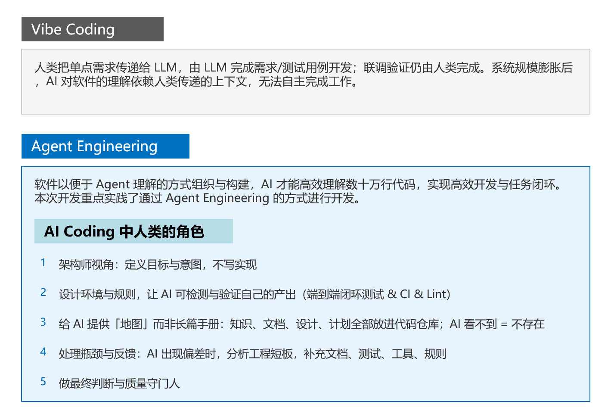

#### 4.2.2. [BMAD-Method工具](https://docs.bmad-method.org/tutorials/getting-started/)

这是一套符合Agent Engineering工程理念的一个工具，先介绍一下他是什么：

官方介绍，核心要点：一个AI-driven development的框架，定义了一套工作流，可以规范AI编码的开发过程
```txt
The BMad Method (Build More Architect Dreams) is an AI-driven development framework module within the BMad Method Ecosystem that helps you build software through the whole process from ideation and planning all the way through agentic implementation. It provides specialized AI agents, guided workflows, and intelligent planning that adapts to your project’s complexity, whether you’re fixing a bug or building an enterprise platform.

If you’re comfortable working with AI coding assistants like Claude, Cursor, or GitHub Copilot, you’re ready to get started.
```

看官方介绍还是有点抽象，那么再看一个图

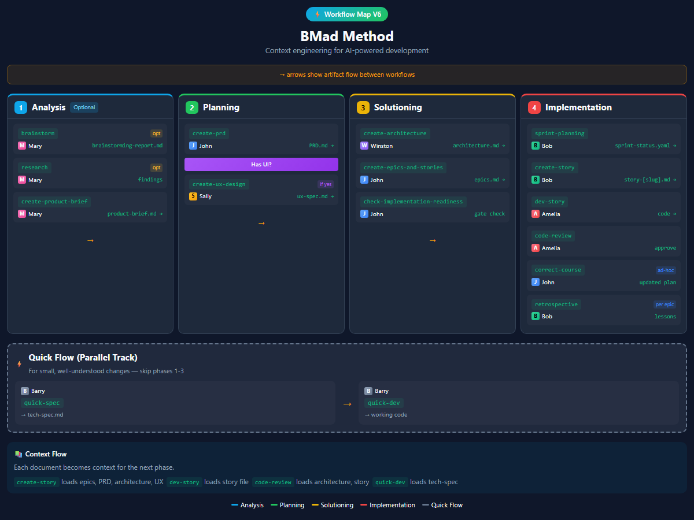 

还是有点抽象，那么我们来看个例子：BMAD通过定义一个human-in-the-loop的工作流，一步步引导人类思考，定义一个开放问题的方案


总结一下：

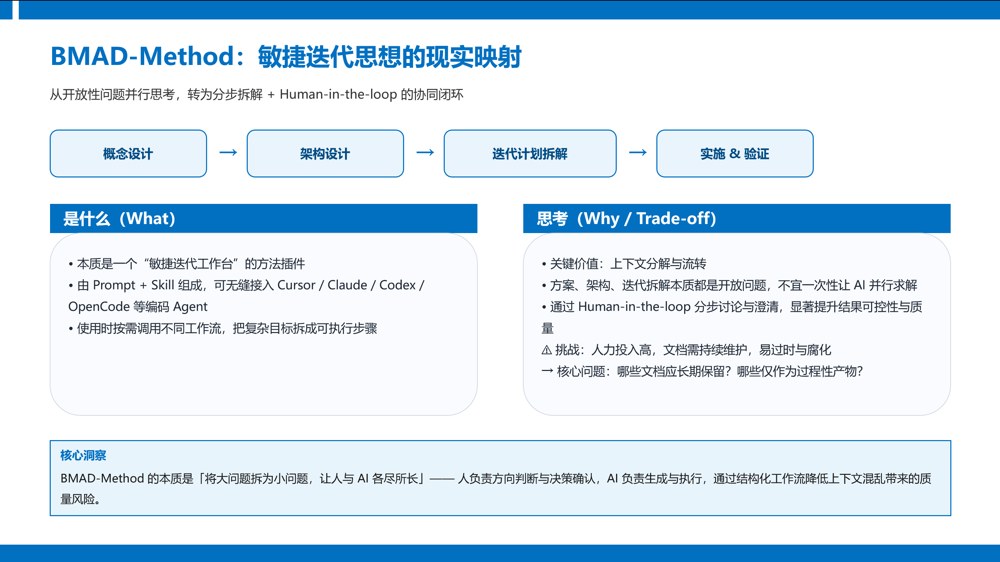

### 4.3. 本地闭环能力构筑

在本次比赛中，测试环境有两个，工具调用服务器与大模型，均部署在内网。那么，为了让AI的代码在本地可运行，搭建了工具调用Mock服务器 & 大模型Proxy & 测试用例运行判题器。

在后续的本地调测中，测试用例运行判题器起到了非常重要的作用，这可以作为最终人类验收AI成果的依据，为方便人类检阅测试结果，同时方便AI分析测试结果，我还为用例判题器添加了网页展示与关键日志存储，人类查看网页，AI根据日志进行迭代

最终，我可以这样让AI干活：
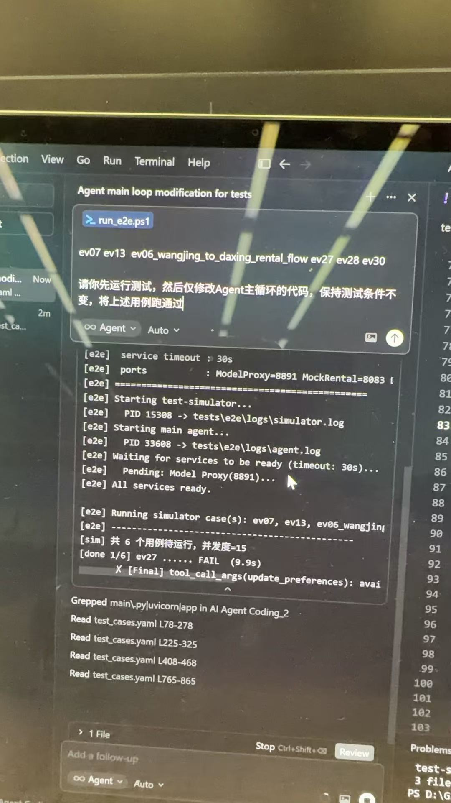

随后，我通过e2e测试报告，检查本次迭代的完成情况

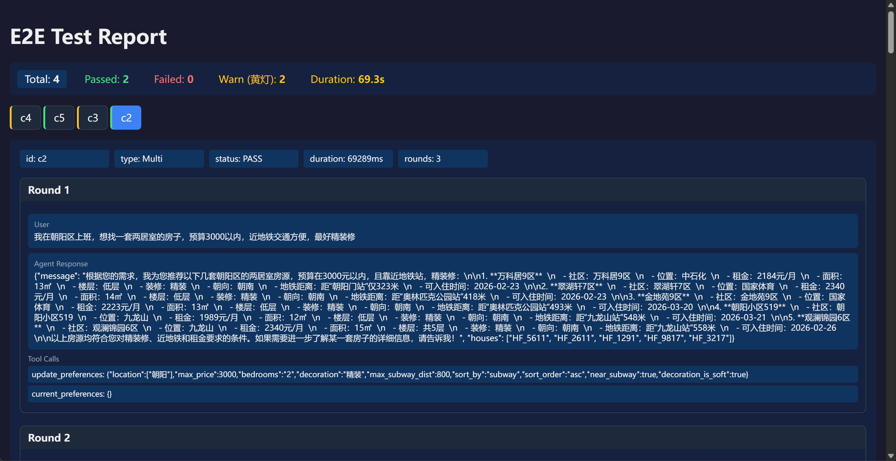

### 4.4. 算法设计与调优

这是整个比赛最核心的部分，如何让qwen3-32b这个模型准确的识别用户意图，我的做法总结如下：

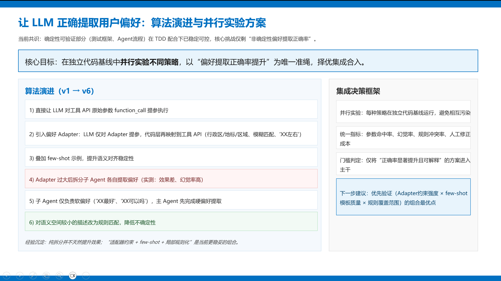

## 5. 我的下一步思考

1. 如何以BMAD-Method作为蓝本，对比OpenClaw的文档设计，以及OpenAI的实践，设计自己的工作流，将Doc作为一等公民，固化下来
2. 能否让一个Agent控制cursor/claude完成“概念设计” -> “架构设计” -> “迭代分解” -> “迭代开发”的全过程，真正做到意图驱动开发？（也许这就是OpenClaw存在的价值）
3. 继续我的Paper-Analysis项目，以Agent Engineering的方式完成重构！这次核心要攻克让AI具备非确定性算法迭代的挑战